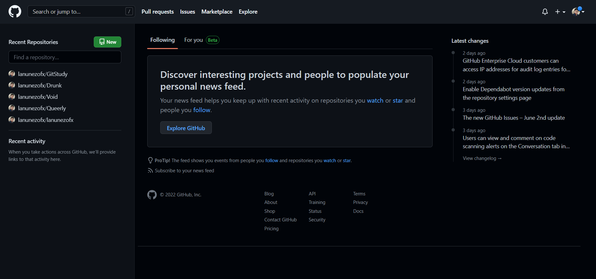
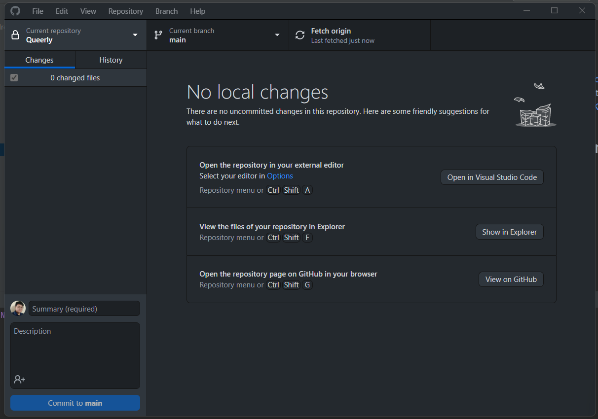
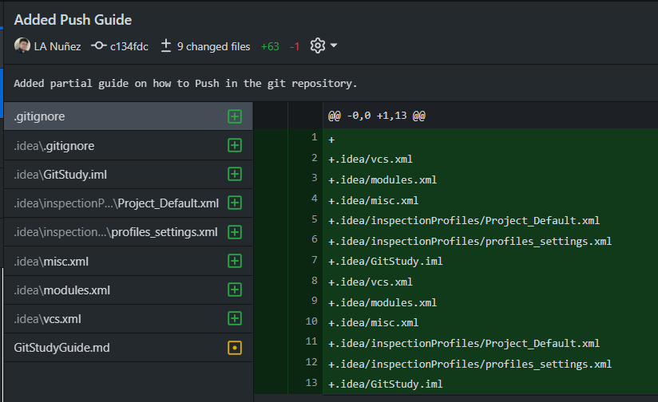
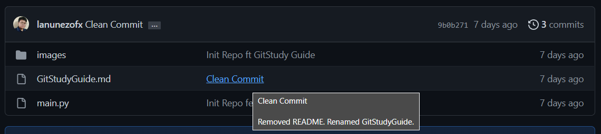
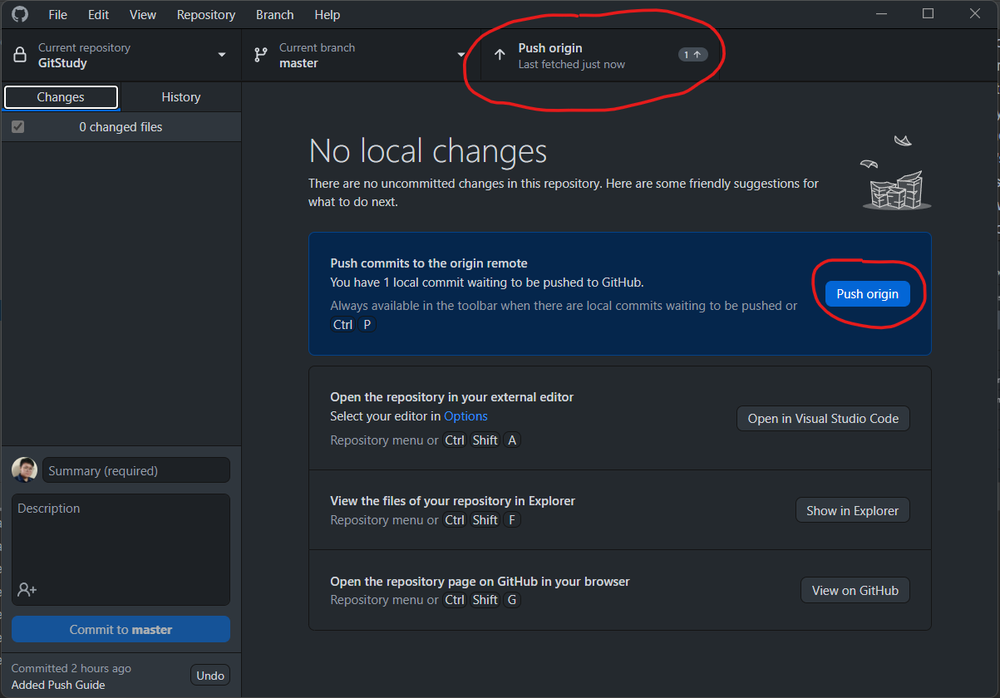
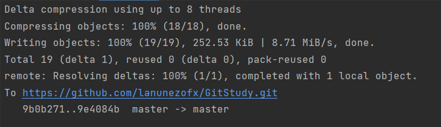
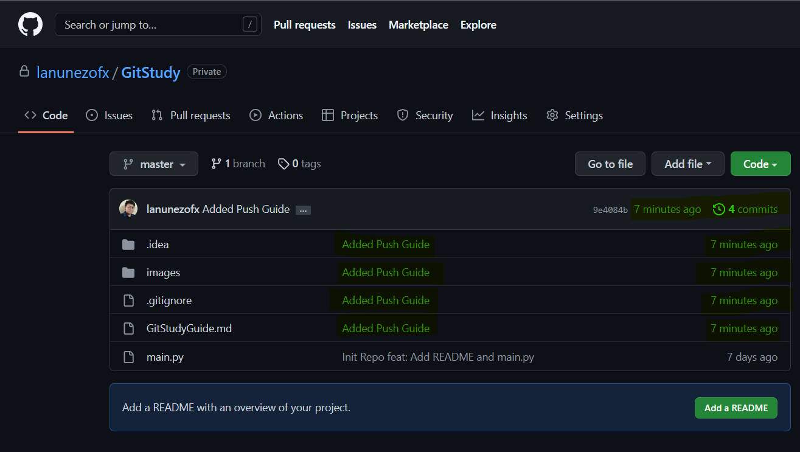
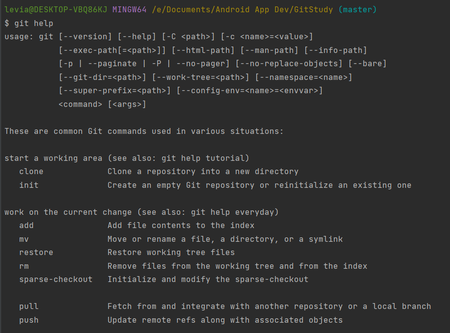

# Git Study
I really wanted to understand more about Git and GitHub and the other definitions that entails it. Therefore, I had this repo to save all my findings about starting out with Git. 

## References
- freeCodeCamp.org 
  - https://www.youtube.com/watch?v=RGOj5yH7evk 
- Beginner tutorial for Git, GitHub, and GitHub Desktop
  - https://youtu.be/8Dd7KRpKeaE 

## Definition of Terms
- Git is a version control system that works best in managing and tracking changes in the project you're working on. 
- GitHub is the remote or cloud-based hosting service that lets you manage your Git repos.
- Repository or repos in Git is a storage system of all your project's file and can contain discussions of your file's version history. **All git repos or repository is a folder, but not all folder is a git repo.**
  
- GitHub desktop is the extension of GitHub in your desktop. It works the same as the GitHub website with few limitations. It's recommendable to use a GitHub desktop for beginners. It has a Graphical User Interface(GUI) that helps user to do basic and needed git commands in a few clicks. Once you have the GitHub desktop, there's no need to do it again in the CLI.
  
- Git Bash refers more to the set of commands used to run Git in a terminal or command line. Bash is the acronym for Bourne Again Shell.
- local directory means the directory you have in your local unit or pc. It is not accessible to the public and originally yours.
- remote or remote directory refers to the directory that can be found in the cloud. 

## Specifics
- Initialize a normal directory to be a git repo
  - Create a folder in your local directory
    ~~~
    $ cd new_dir
    ~~~
    - '$ cd new_dir' this command allows you to move to the new folder in your local directory.
    
    ~~~
    $ git init
    ~~~
    
  - Do some changes in your new directory
    - Be gay, do your craft.
    ~~~
      $ git status
    ~~~
    - '$ git status' after doing your thing check the status of your repo. This might say untracked files, so you have to add it.
    
    ~~~
      $ git add README.md
    ~~~
    - The README.md here is just a sample file which I added. *If you want to add (track) all the untracked file you can just use period (.)*
    ~~~
    $ git add .
    ~~~
  
  - Commit (secure save) the changes you did on your local repo. *NOTE: Before you can push anything to your remote directory (repository) you have to commit those files.*
    - But first, do you want to know why it's important to commit your files as often in git? Here's why: 
      - https://medium.com/@tournetorres/git-why-is-it-important-to-commit-130c3890e582
    ~~~
    $ git commit -m "Initialized Git Repo" -m "Initialized local dir to Git master. Added README.md"
    ~~~
    - *NOTE: Be mindful of your current branch when committing changes.*
    
      - git - standard gitbash script to call git.
      - commit - script to commit
      - -m "Title, description, or any message" - dash m is the shorthand notation for message. 
        - If you were to look on the GitHub Desktop interface for commit, there's title and description. 
      
        - Same goes with the CLI command, the first -m is for the title/summary and the second -m is for the description.
  - Additional: If you haven't pushed your last commit yet, you can simply amend it to your last commit if it goes the same version of your progress. The command given above is without messages. You can use the git commit –amend command to edit a commit message. To do so, use the -m flag and specify a new commit message in quotation marks.
  ~~~
  $ git commit --amend
  ~~~
  or
  ~~~
  $ git commit --amend -m "Smth to change title" -m "Smth to change desciption"
  ~~~
  
    - Read more about git commit amend @
      - https://careerkarma.com/blog/git-commit-amend/#:~:text=The%20git%20commit%20%E2%80%93amend%20command,visible%20in%20the%20project%20history.
- Pushing to the Git Repository
  - Whenever there's changes you've done commiting, you need to push it in the remote repository to be available for the other user/member of that repository to see your changes. 
  - To push, make sure there were changes committed. If no changes committed, then there's actually no need to push anything. For this example,I committed something the last edit for pushed and titled it "Added Push Guide" with description "Added partial guide on how to Push in the git repository."

  - Take a look at this GitHub repo update I got the last time. The last push was witten 7days ago from the writing of this guide.  

  - If we were to compare the details we had from our last commit today [GitHub desktop] versus the details we saw in the GitHub repo, the update in the GitHub repo was 7 days late. It means that our latest commit wasn't committed yet in our remote GitHub repo. 
  - '$ git push origin master' command allows you to push to the origin/master branch. *NOTE: 'master' can also be 'main' it really depends on the default repository you have.*
  ~~~
  $ git push origin master
  ~~~
  - The use of upstream or shorthand -u helps us to push to our upstreamed directory. To do this we can just use the command 
  ~~~
  $ git push -u origin master 
  ~~~
  - By the next time we push, we can now use just the git push command. It will automatically be pushed on our upstreamed directory.
  ~~~
  $ git push
  ~~~
  - Using the push command is the same as using the push interface in the GitHub Desktop. Frankly, it's easier to use the GitHub Desktop if you're just starting out with Git. But as you advance, it's better to know how to use the Command Line Interface (CLI) too.
  
  - To confirm that your push was success, you can recheck if the changes was pushed in your remote GitHub repo. 
  
  
- Pulling from the Git Repostory
  - When working in a collaborative project, Git is the version control you needed best. Once a member of the project pushes in the Git repository, it's time for the other members to pull those changes to synch with the others.

## Help
If you're ever stuck with something about Git. You have the whole wide internet to ask from. Or if you want to ask a definition straight from Git, well a simple help command can give you answers. 
~~~
$ git help
~~~

## Contact Me
Hi! I am LA. I am still learning a lot of things. If you want to know more about me or share points with me, I would love to hear it out from you. 

Send me an e-mail via lanunez.ofx@gmail.com 