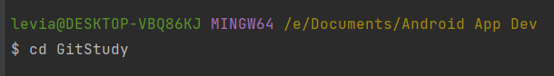
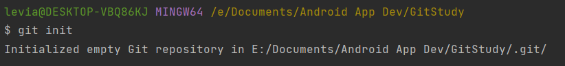
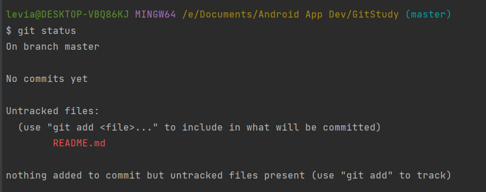
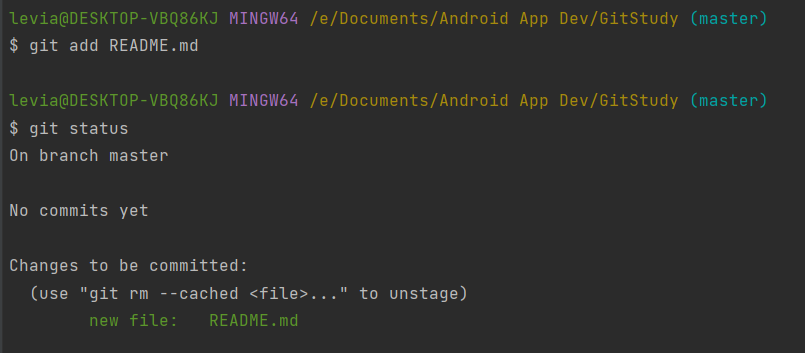
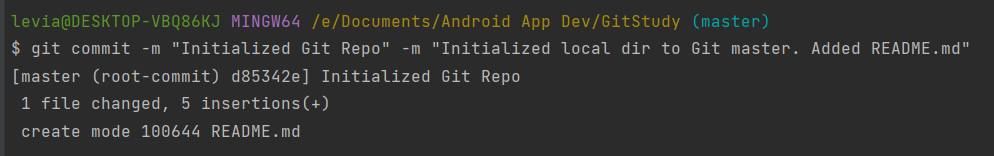
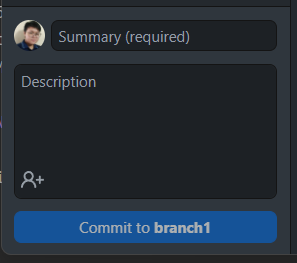
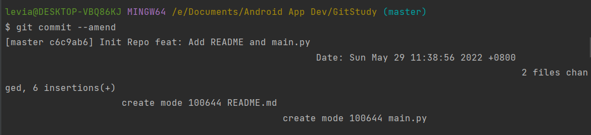

# Git Study
This directory is for LA to practice Git in the CLI

## References
- freeCodeCamp.org 
  - https://www.youtube.com/watch?v=RGOj5yH7evk 
- Beginner tutorial for Git, GitHub, and GitHub Desktop
  - https://youtu.be/8Dd7KRpKeaE 

## Specifics
- Initialize a normal directory to be a git repo
  - Create a folder in your local directory
    - '$ cd new_dir' this command allows you to move to the new folder in your local directory.
    
    - '$ git init'
    
  - Do some changes in your new directory
    - Be gay, do your craft.
    - '$ git status' after doing your thing check the status of your repo. This might say untracked files, so you have to add it.
    
    - '$ git add README.md' The README.md here is just a sample file which I added. *If you want to add (track) all the untracked file you can just use period (.) '$ git add .'*
  
  - Commit (secure save) the changes you did on your local repo. *NOTE: Before you can push anything to your remote directory (repository) you have to commit those files.*
    - But first, do you want to know why it's important to commit your files as often in git? Here's why: 
      - https://medium.com/@tournetorres/git-why-is-it-important-to-commit-130c3890e582
    - '$ git commit -m "Initialized Git Repo" -m "Initialized local dir to Git master. Added README.md"' *NOTE: Be mindful of your current branch when committing changes.*
    
      - git - standard gitbash script to call git.
      - commit - script to commit
      - -m "Title, description, or any message" - dash m is the shorthand notation for message. 
        - If you were to look on the GitHub Desktop interface for commit, there's title and description. 
      
        - Same goes with the CLI command, the first -m is for the title/summary and the second -m is for the description.
  - '$ git commit --amend' Additional: If you haven't pushed your last commit yet, you can simply amend it to your last commit if it goes the same version of your progress. The command given above is without messages. You can use the git commit –amend command to edit a commit message. To do so, use the -m flag and specify a new commit message in quotation marks.
  
    - Read more about git commit amend @
      - https://careerkarma.com/blog/git-commit-amend/#:~:text=The%20git%20commit%20%E2%80%93amend%20command,visible%20in%20the%20project%20history.
- Push
- Branches